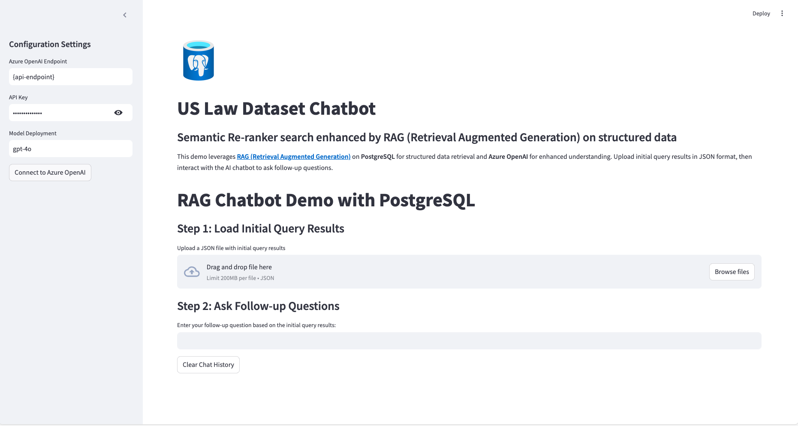

# AI on Azure PostgreSQL Flexible Server

This project demonstrates how to use AI-driven features on Azure PostgreSQL Flexible Server. It includes steps to set up the environment, populate the database with sample data, and use various AI-driven features to enhance your application.

## Lab Content

1. [Part 0 - Log into Azure](#part-0---log-into-azure)
1. [Part 1 - Getting started with AI on Azure PostgreSQL flexible server](#part-1---getting-started-with-ai-on-azure-postgresql-flexible-server)
    1. [Clone TechConnect Lab repo](#clone-techconnect-lab-repo)
    1. [Connect to your database using psql in the Azure Cloud Shell](#connect-to-your-database-using-psql-in-the-azure-cloud-shell)
    1. [Populate the database with sample data](#populate-the-database-with-sample-data)
    1. [Setting up pgAdmin](#setting-up-pgadmin)
    1. [Install and configure the `azure_ai` extension](#install-and-configure-the-azure_ai-extension)
1. [Part 2 - Using AI-driven features in Postgres](#part-2---using-ai-driven-features-in-postgres)
    1. [Using Pattern matching for queries](#using-pattern-matching-for-queries)
    1. [Using Semantic Search and DiskANN](#using-semantic-search-and-diskann-index)
1. [ Part 3 - How RAG chatbot accuracy improves with different technique](#part-3---how-rag-chatbot-accuracy-improves-with-different-technique)
    1. [Exploring Cases RAG application](#exploring-cases-rag-application)

## Build Simple RAG Application Locally

### Setting up the environment file

Since the local app uses OpenAI models, you should first deploy it for the optimal experience.

1. Copy `.env.sample` into a `.env` file.
2. To use Azure OpenAI and Postgres Docs, fill in the values of `AZURE_PG_CONNECTION`,`AZURE_OPENAI_ENDPOINT` and `AZURE_OPENAI_API_KEY` based on the deployed values.

### Install dependencies
Install required Python packages and streamlit application:

```python
python3 -m venv .ignite_lab
source .ignite_lab/bin/activate
```

```bash
pip install -r requirements.txt
```

### Running the application
From root directory

```bash
cd App
streamlit run rag_chatbot.py
```

When run locally run looking for website at http://localhost:8501/




